## Instruction

#### 一、流程

* 数据收集（skill脚本自动化生成版图）
* 数据封装
* 模型训练（CNN）
* 评估

#### 二、项目位置

[GitHub - hyuhang13/AI4RFIC: nothing](https://github.com/hyuhang13/AI4RFIC.git)

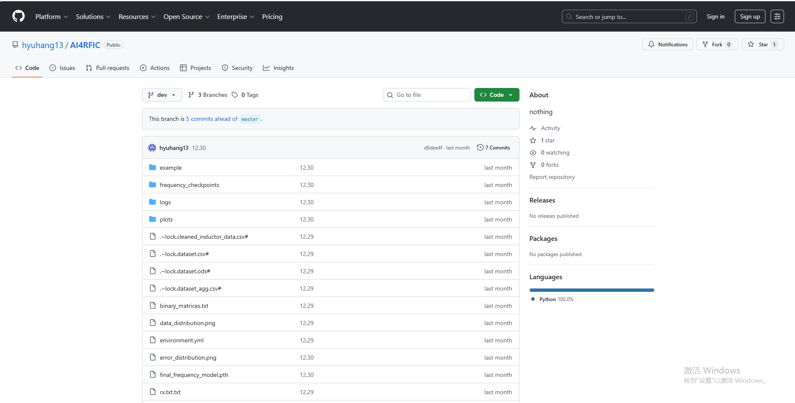

#### 三、具体过程

##### （一）数据收集

该部分主要在Cadence中SKILL IDE环境中运行skill脚本实现自动化生成版图，并调用EMX仿真，获取无源版图S参数。

- 文件

该部分需要涉及三个文件：

1. 原始随机矩阵文件，即是Python生成的随机版图二进制文件，binary_matrices.py为生成随机二进制矩阵的Python文件，右边是生成的文件。为方便起见这里把原始数据分为五份，同时开5个workspace进行数据收集，提高速度，这里我们以part1_4.txt为例。

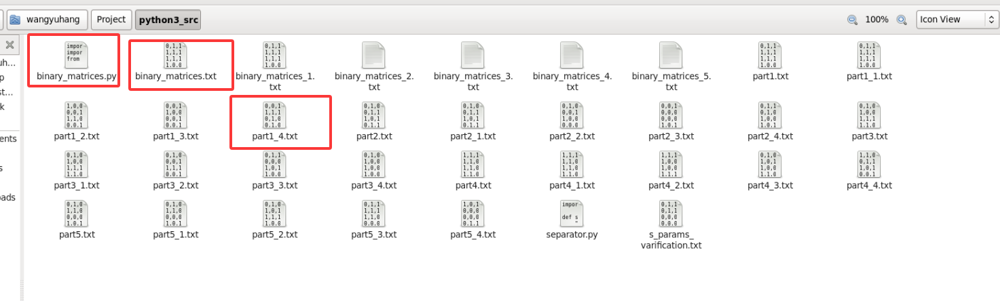

2. 核心skill脚本，调用virtuoso进行生成版图，并调用EMX仿真实现S参数的收集，如下图所示（如上面所说，复制五份脚本）。

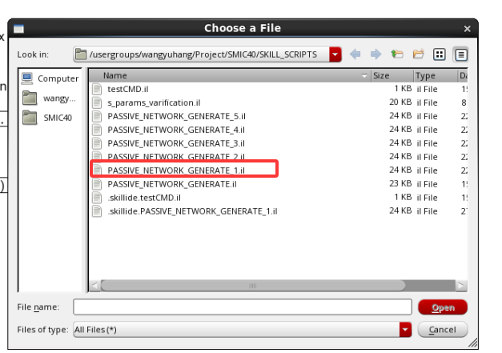

        调用需要首先更改脚本中的原始数据文件路径，代码中还有许多本机保留的路径，这里不尽详述，需依次修改为自己的路径。

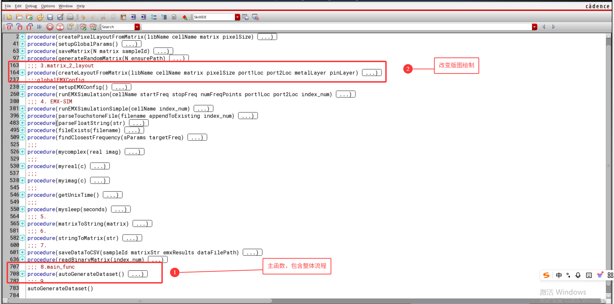

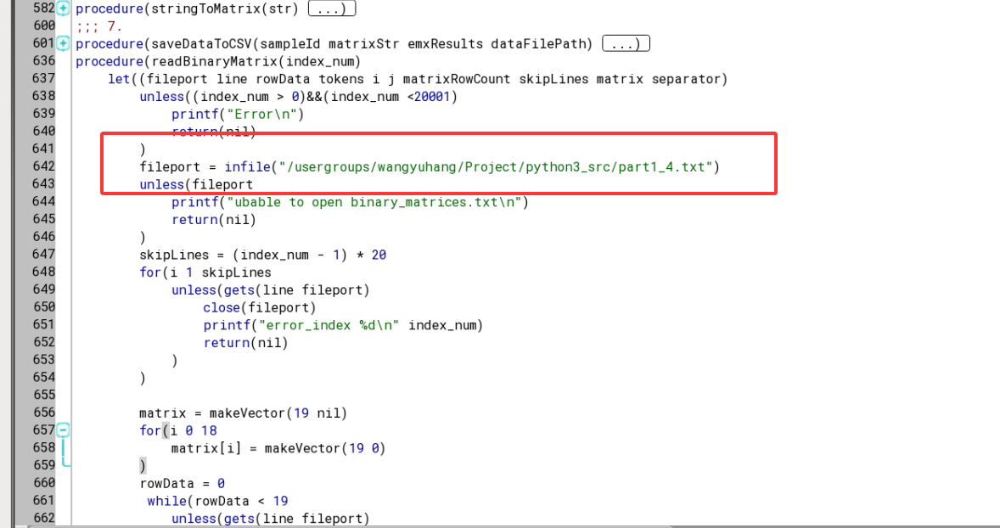
###### $着重说明^*$

运行代码之前一定要根据自己的环境路径更改下面的EMX仿真函数中的命令行，下面三个矩形框自上到下，依次为函数名、生成的版图导出为gds的cmd命令、调用EMX的cmd命令，后两者需要自己在环境中真实运行streamout和EMX仿真得到。

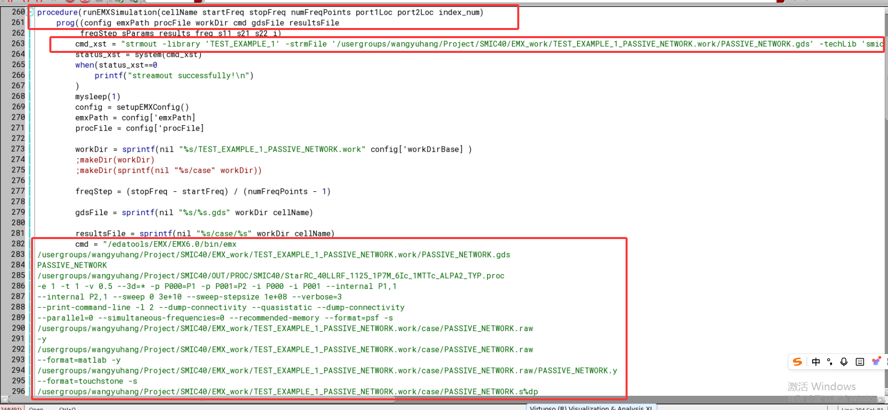

在终端运行该skill脚本。终端输入：load“/usergroups/wangyuhang/Project/SMIC40/SKILL_SCRIPTS/PASSIVE_NETWORK_GENERATE_1.il”

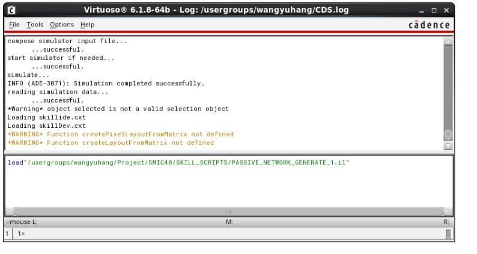

3. 生成的S参数文件会依次封装到自己指定的文件目录下，笔者习惯不好，所以仍保留在EMX仿真生成的文件目录下。

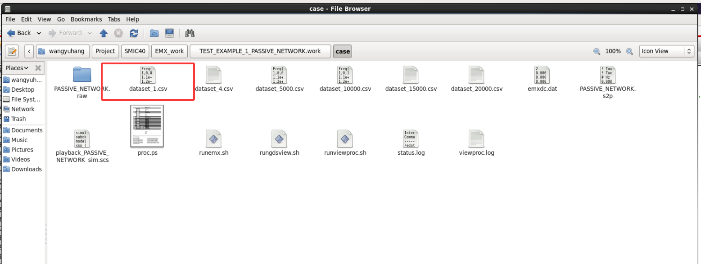

##### （二）数据封装

这部分没有SOP，笔者是首先手动将上述多个生成的dataset.csv装入一个文件中，可以自己写一个Python代码完成多个dataset.csv的封装，这其中涉及一些文件头的操作和读取，因人而异。

封装之后需要完成一个数据集的合成与封装，这部分较为麻烦，涉及到数据结构的设计与考量。

首先，下图所示为主要涉及到的几个文件，由于创建的类比较多，这里只着重说明需要修改的文件。

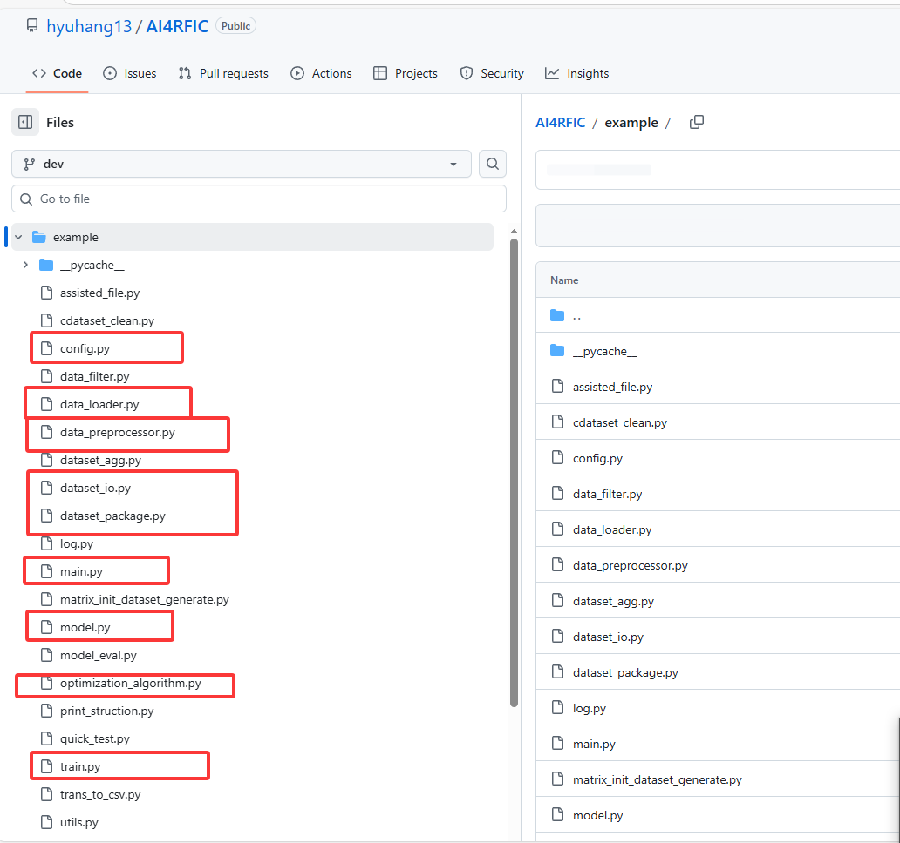

- config.py为整体优化框架的超参数配置，其中包括遗传算法的参数配置、模型超参数配置。

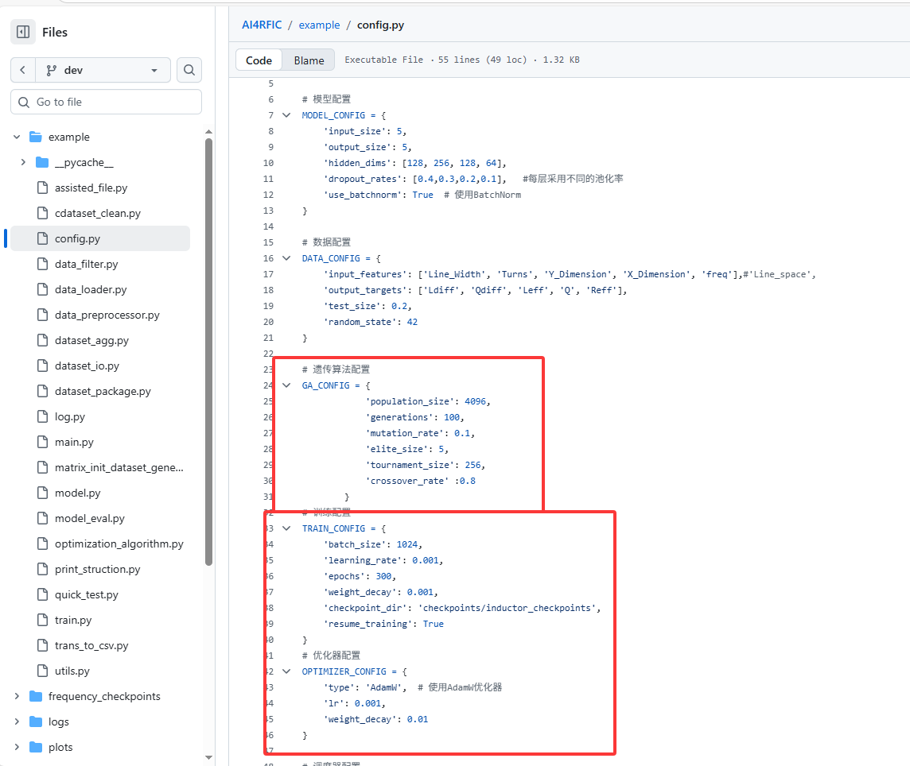

- data_loader.py为封装所调用类

- main.py为主函数，可以选择单纯训练模型，或进行优化算法的运算

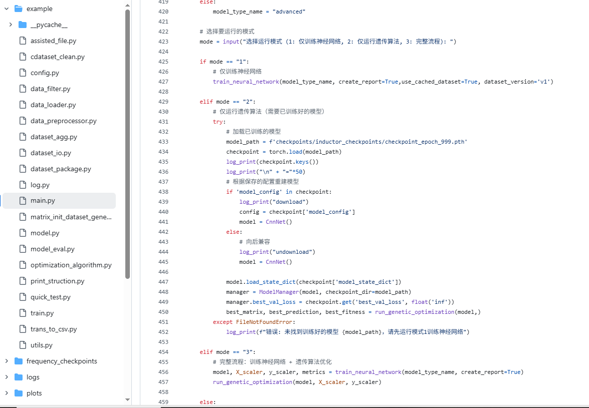

- model.py为模型定义类文件，可以改写模型的结构设置，特别是改写模型的输入输出头（对于多端口器件），这里必须说明由于更改输入输出元素数将会影响数据结构的封装，可能会产生一系列报错，所以可能整体代码许多细节需要修改

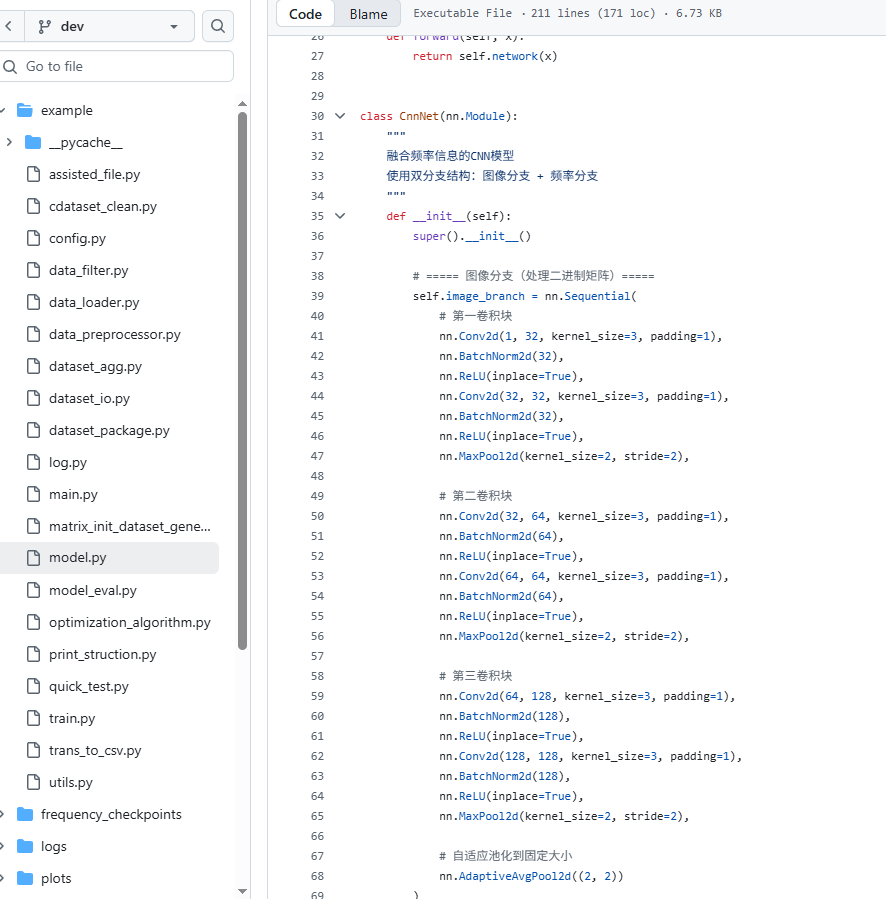

- optimization_algorithm.py为优化算法的整体文件，定义了优化算法类，该部分需要关注的只有优化算法的代价值公式的修改，即是寻找该无源器件的搜索方向

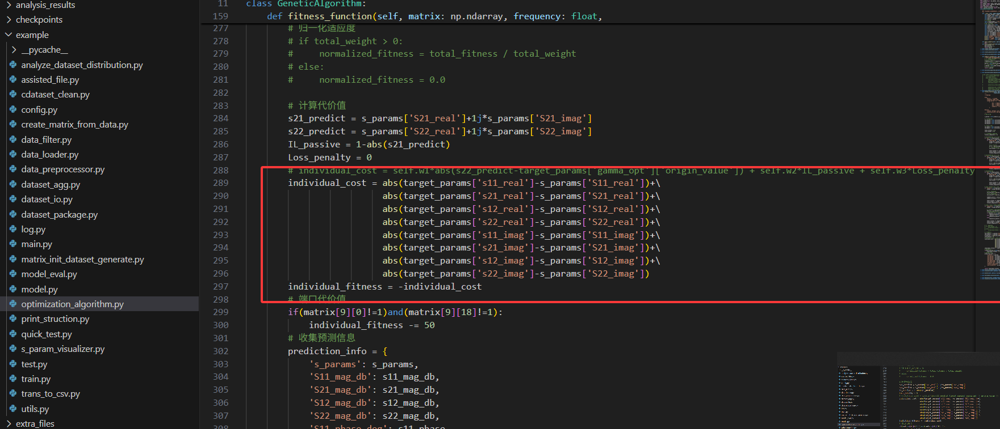

在看完上面的基础文件介绍后，我们来具体说明一下数据封装，首先需要把从eda服务器中得到的数据文件放到指定的工作目录下，然后进行数据预先的数据处理成上面的工程文件可以直接读取的格式，然后maybe需要修改代码的数据结构类，然后直接开始训练模型，训练过程的第一次会自动进行封装，将会耗时很长时间进行读取与保存，后续可直接加载生成好的数据集（pkl），开始进行训练。

这个过程没有SOP，所以可能需要自己花费一些时间，同时也取决于所收集的数据集的大小。

##### （三）模型训练

- 首先需要配置环境，可以克隆已经目前配置好的镜像。

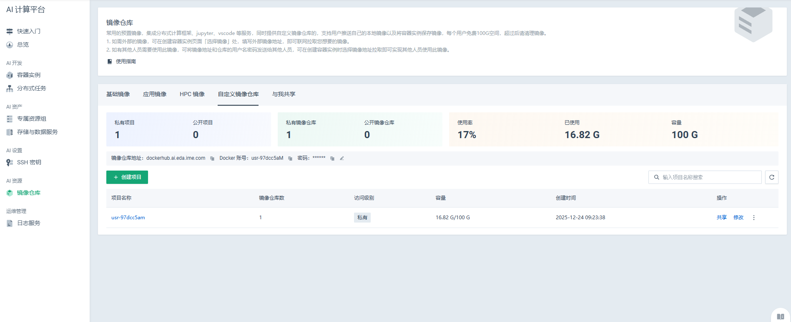

- 在上述服务器中终端中对应工作空间下直接输入python3 example/main.py即可，按照提示依次选择。
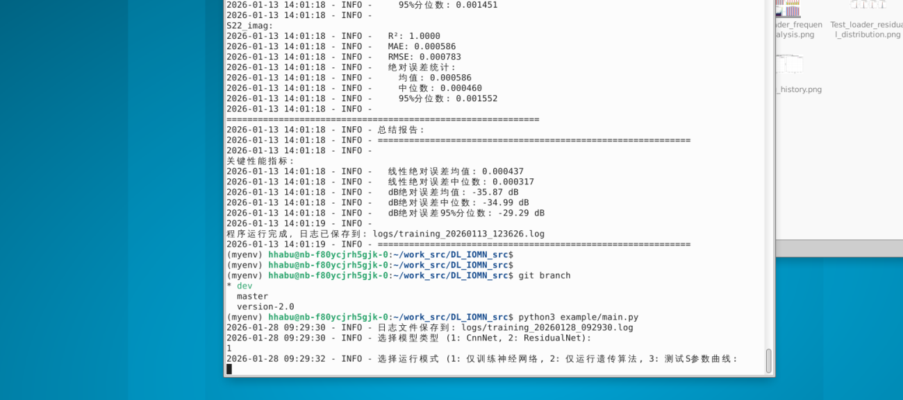

##### （四）模型性能评估

比较麻烦的一部分也在于模型的性能评估，由于没有可参考的先例，这里我们采用的评估指标较为多样化，主要代码文件在上面的train.py中：

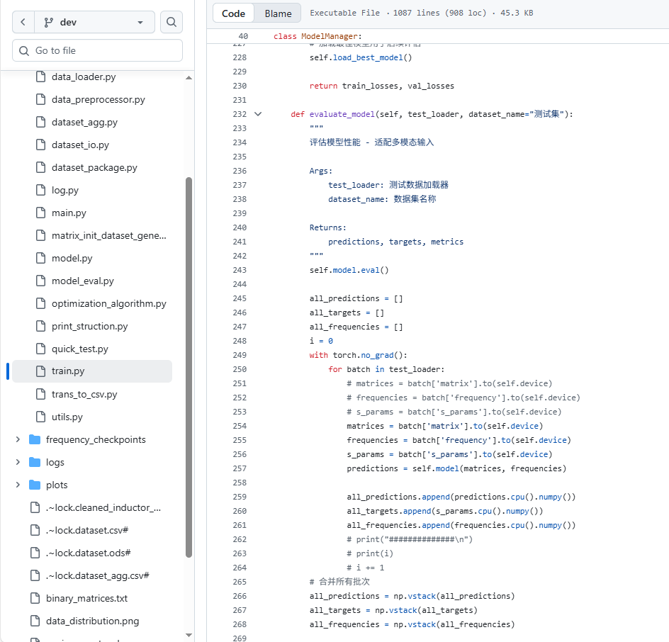

这里模型评估涉及到的函数较多，包括基础的测试集样本预测、绘图、报告生成等函数，中间还残留有一些未使用的函数，比较冗余，有待优化。我们主要关注的是预测值与真实值的比例图像以及样本预测得到的S参数随频率变化的曲线与真实值的对比图。

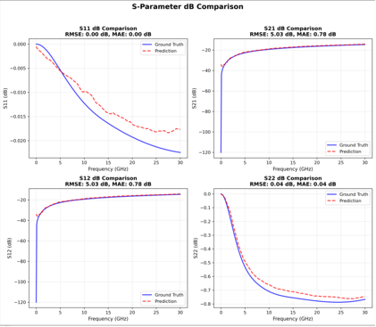
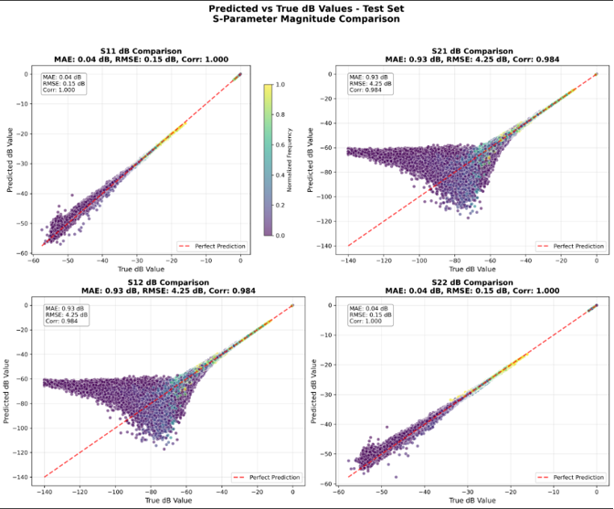

###### $最后^*$

这里需说明，目前项目版本还没有到可以自由配置的优化阶段，属于专用的模型训练代码，所以仅具有参考价值，若想适配别的多端口器件，需要进行大量修改，特此声明。

